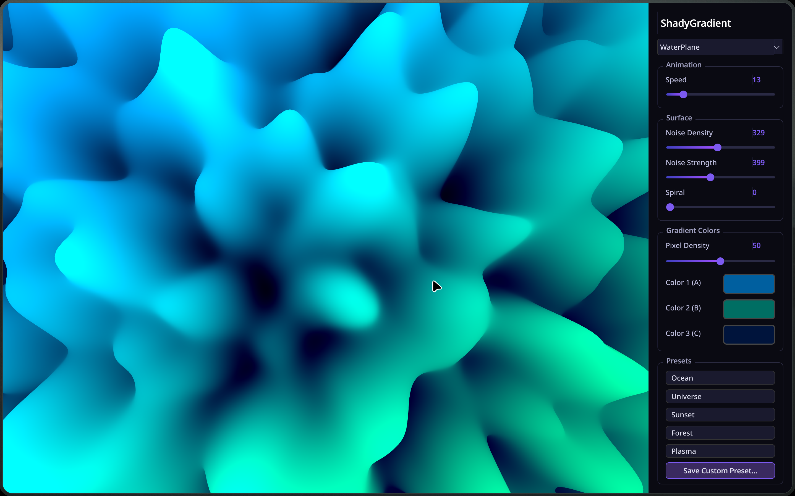

# ShaderQt

ShaderQt is a modern C++ and QML library for Qt 6 that provides smooth, beautiful, and highly customizable shaders based on the [ShaderGradient](https://github.com/ruucm/shadergradient) project. It provides an easy-to-use API for embedding complex WebGL-style animated gradients in both traditional QWidget-based applications and modern QML interfaces.



## Features

* **Widget Support**: Drop-in `ShadyGradientWidget` (inherits `QOpenGLWidget`) for Qt Widgets applications.
* **QML Support**: `ShadyGradientItem` and `ShadyGradientEffect` for seamless integration into Qt Quick / QML.
* **Customization**: Real-time adjustment of colors, animation speed, noise density, noise strength, and more.
* **Multiple Types**: Choice between different visual projection styles (e.g., `WaterPlane` and `Sphere`).
* **Cross-framework**: Supports both Qt 5 and Qt 6 automatically via CMake.

## Building & Installation

ShaderQt uses CMake. To build and install the library and preview application:

```bash
mkdir build
cd build
cmake ..
cmake --build .
# Optional: run the installation
sudo cmake --install .
```

### Trying the Preview App

The project comes with a standalone preview application that allows you to play with the shader uniforms in real-time.

```bash
./build/shaderqt-preview
```

## Quick Start

### QML (Qt Quick)

Ensure the module is imported in your QML file. When building with CMake, the QML module is registered automatically under `ShaderQt 1.0`.

```qml
import QtQuick 2.15
import QtQuick.Window 2.15
import ShaderQt 1.0

Window {
    width: 640
    height: 480
    visible: true
    title: "ShaderQt QML Example"

    ShadyGradientItem {
        anchors.fill: parent
        type: ShadyGradientEffect.WaterPlane
        speed: 0.3
        noiseDensity: 1.5
        noiseStrength: 0.8
        spiral: 2.0
        color1: "#00C8FF"
        color2: "#B400FF"
        color3: "#001450"
    }
}
```

### C++ (Qt Widgets)

Link against the `shaderqt` target in your `CMakeLists.txt`:

```cmake
find_package(shaderqt REQUIRED)
target_link_libraries(my_app PRIVATE ShaderQt::shaderqt)
```

In your application:

```cpp
#include <QApplication>
#include <shaderqt/ShadyGradientWidget.h>

int main(int argc, char *argv[]) {
    QApplication app(argc, argv);

    ShadyGradientWidget widget;
    widget.setSpeed(0.5f);
    widget.setColor1(QColor("#00C8FF"));
    widget.setColor2(QColor("#B400FF"));
    widget.setColor3(QColor("#001450"));
    widget.setType(ShadyGradientWidget::Type::WaterPlane);
    widget.resize(800, 600);
    widget.show();

    return app.exec();
}
```

## JSON Presets

ShaderQt supports natively importing and exporting presets. When constructing your widget or item, ShaderQt automatically searches the local directory for `shady_gradient_preset.json`.

You can use the included `shaderqt-preview` application to design your gradient visually, click "Save Custom Preset...", and instantly have it appear in your Qt application on the next launch!

## Acknowledgments

The core shaders and mathematical grounding for the cosmic gradients used in this library are heavily based on the [ruucm/shadergradient](https://github.com/ruucm/shadergradient) project. This project adapts and ports those amazing WebGL shaders into native OpenGL for Qt.

## Documentation

Full API documentation and advanced usage instructions can be found in the [docs/API.md](docs/API.md) file.